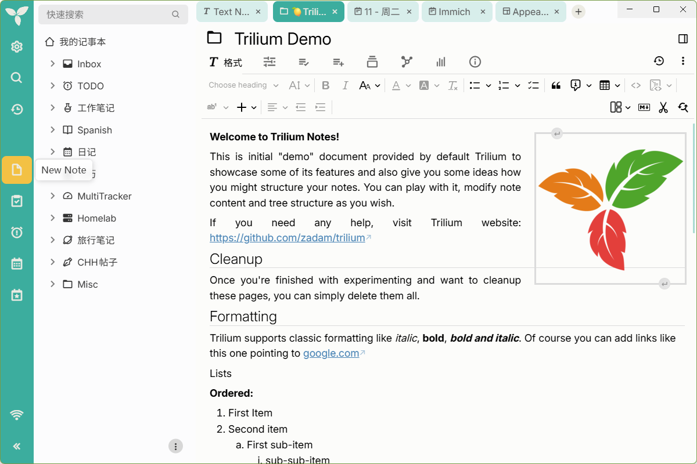

# 🍋 lemon-tree
A theme for [Trilium Notes](https://github.com/TriliumNext/Trilium), (>= 0.94.x) "_a free and open-source, cross-platform hierarchical note-taking application with focus on building large personal knowledge bases_". 

I have been using this app for some time and really liked the [melon-4 theme](https://github.com/raphwriter/trilium-theme-melon). But after trilium was handed over to the TriliumNext team, it was not updated with the new base theme. So I took it into my hands. I am trying to achieve the original feel of melon-4, adding some delightful twists.

Sometimes things break (e.g. due to updates of the application) - please don't hesitate to file an issue!

## Screenshots
### Main Window

## Theme Installation

### Please follow the official instructions [here](https://github.com/TriliumNext/Trilium/wiki/Themes).

#### In a nutshell:
Install the theme by following these steps:
- copy the (**raw**) content of [lemon-tree.css](./lemon-tree.css)
- paste it into a new trilium **code** note (type: CSS) named "lemon-tree"
- add a new attribute to the lemon-tree note `(Alt + A)`
  - either copy & paste `#appTheme=lemon-tree` to the node's attributes
  - or use the UI with these settings
    - Type: Label
    - Name: appTheme
    - Value: lemon-tree
    - inheritable: _not ticked_
- add a new attribute to the lemon-tree note `(Alt + A)`
  - either copy & paste `#appThemeBase=next-light` to the node's attributes
  - or use the UI with these settings
    - Type: Label
    - Name: appThemeBase
    - Value: next-light
    - inheritable: _not ticked_
- go to Menu > Options
- select it as your new theme

## Additional Fonts
Not yet implemented

